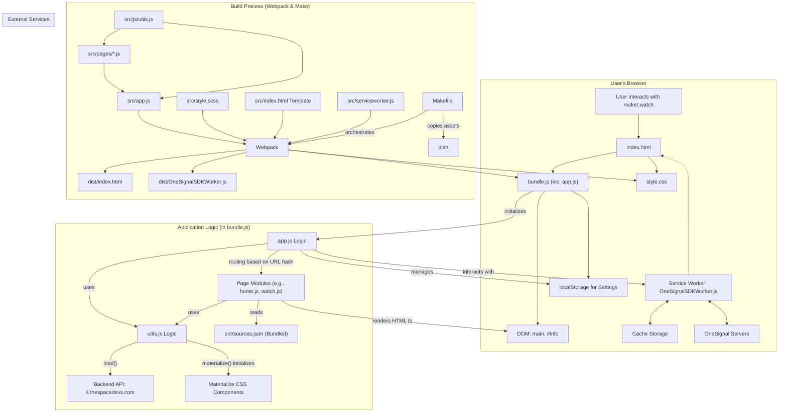

# rocket.watch - Technical Documentation

This document provides a detailed technical overview of the rocket.watch frontend project, including its architecture, core functionalities, build process, and developer guidelines.

## 1. Architecture Overview

The rocket.watch frontend is a client-side focused Single Page Application (SPA) with Progressive Web App (PWA) features. Its primary goal is to display information about rocket launches by fetching data from the Launch Library API and augmenting it with other sources. Server-side aspects are minimal and primarily rely on third-party services.

### Core Technologies:
*   **Frontend Framework**: Vanilla JavaScript (ES6 Modules)
*   **UI Styling**: Materialize CSS, SCSS for preprocessing
*   **Build System**: Webpack, with `make` for orchestrating build tasks
*   **Primary Data Source**: Launch Library API (`https://ll.thespacedevs.com/2.0.0/`)
*   **Auxiliary Data Source**: Local `src/sources.json` for curated content and custom links

### Architectural Diagram:



### Data Flow:
1.  The application shell (`index.html`) loads `bundle.js`.
2.  `app.js` (within `bundle.js`) initializes and parses the URL hash for routing.
3.  The appropriate page module from `src/pages/` is invoked.
4.  The page module uses `utils.js`'s `load()` function to fetch data from the Launch Library API.
5.  It may also use data from the bundled `src/sources.json` to augment information or provide custom links.
6.  The page module dynamically generates HTML and injects it into the main DOM elements (`<main>` and `#info`).
7.  `utils.js`'s `materialize()` function is called to initialize any Materialize CSS components in the newly rendered HTML.

## 2. Project Structure

```
/
├── .gitignore
├── Makefile           # Orchestrates build, serve, and deployment tasks
├── README.md          # High-level project overview
├── TECHNICAL_DOCS.md  # This file
├── config.json        # (Purpose to be determined if significant)
├── netlify.toml       # Netlify deployment configuration
├── now.json           # Vercel (Now) deployment configuration (possibly legacy)
├── package-lock.json  # Exact dependency versions
├── package.json       # Project dependencies and scripts
├── webpack.config.js  # Webpack build configuration
├── src/               # Main application source code
│   ├── app.js         # Core application logic, routing, initializations
│   ├── index.html     # Base HTML template for the SPA
│   ├── serviceworker.js # Custom service worker logic (for Workbox)
│   ├── sources.json   # Local data for featured content, custom links, etc.
│   ├── style.scss     # Main SCSS stylesheet
│   ├── assets/        # Static image and icon assets
│   ├── js/            # Utility JavaScript files
│   │   ├── fontawesome.js # Font Awesome integration
│   │   └── utils.js     # Core utility functions (API, date, countdown, etc.)
│   ├── pages/         # Modules for each application view/page
│   │   ├── home.js
│   │   ├── watch.js
│   │   └── ... (other page modules)
│   └── static/        # Other static files (e.g., ads.txt)
└── dist/              # Generated build output (not in source control)
    ├── bundle.js
    ├── style.css
    ├── index.html
    ├── OneSignalSDKWorker.js
    └── ... (other assets)
```

## 3. Core Functionalities & Modules

### 3.1. Application Initialization & Routing (`src/app.js`)
*   **Entry Point**: `src/app.js` is the main entry point defined in `webpack.config.js`.
*   **Initialization**: Sets up event listeners for `DOMContentLoaded` and `hashchange` to trigger the `init()` function.
*   **`init()` Function**:
    *   Resets page state (title, scroll).
    *   Clears previous content and displays a loading animation.
    *   Clears old countdowns and Materialize tooltips.
    *   Uses `QueryString()` from `src/js/utils.js` to parse URL hash parameters.
    *   Based on parsed parameters, dynamically calls the appropriate page module from `src/pages/`.
    *   Defaults to `home()` if no route matches.
*   **OneSignal Setup**: Initializes OneSignal for push notifications.
*   **Service Worker Registration**: Registers `OneSignalSDKWorker.js`.
*   **Settings Management**: Loads and saves user settings (e.g., dark mode) from `localStorage`.

### 3.2. Data Fetching & API Interaction (`src/js/utils.js` - `load()`)
*   The `load(query, callback)` function in `src/js/utils.js` is the primary interface for fetching data.
*   It constructs the full API URL using `backendURL` (`https://ll.thespacedevs.com/2.0.0/`) and the provided `query` string.
*   Uses the `fetch` API to make GET requests and parses the JSON response.
*   Invokes the `callback` with the fetched data.

### 3.3. Page Rendering (`src/pages/`)
*   Each `.js` file in `src/pages/` typically exports a default function (e.g., `export default function home() {}`).
*   These functions are responsible for:
    *   Fetching necessary data using `utils.js#load()`.
    *   Generating HTML strings or DOM elements based on the data.
    *   Injecting the generated HTML into the `<main>` and/or `#info` elements of `src/index.html`.
    *   Calling `utils.js#materialize()` to initialize Materialize CSS components.

### 3.4. Countdown Logic (`src/js/utils.js`)
*   **`Countdown(date, elementId)`**: Calculates and formats a countdown string (L-/L+) to a given `date`. If `elementId` is provided, it updates the element's content every second. Manages interval IDs in a global `countdowns` array.
*   **`updateCountdown(launch)`**: Fetches updated launch data and refreshes the countdown display if the launch time (`net`) has changed.

### 3.5. User Settings (`localStorage`)
*   Settings (e.g., `dark: true/false`, `version`) are stored in `localStorage` under the key `rocketwatch.settings`.
*   `src/app.js` loads these settings on startup.
*   `src/js/utils.js#saveValue()` provides a mechanism to update settings (typically from UI elements in the settings page).

### 3.6. Progressive Web App (PWA) Features
*   **Service Worker**:
    *   Registered in `src/app.js`.
    *   Source: `src/serviceworker.js`, processed by Workbox (`InjectManifest` in `webpack.config.js`) and output as `OneSignalSDKWorker.js`.
    *   Handles push notifications via OneSignal.
    *   Likely includes caching strategies for offline access (details in `src/serviceworker.js` or Workbox config).
*   **Web App Manifest**:
    *   Generated by `webpack-pwa-manifest` plugin (configured in `webpack.config.js`).
    *   Defines app name, icons, theme colors, start URL, display mode, etc., enabling "Add to Home Screen" functionality.
*   **Push Notifications**:
    *   Integrated via OneSignal SDK.
    *   Initialized in `src/app.js`.
    *   Service worker (`OneSignalSDKWorker.js`) handles receiving and displaying notifications.

### 3.7. Featured Content & Custom Links (`src/sources.json`)
*   `src/sources.json` provides a way to include curated content not available from the main API.
*   **`featuring` array**: Used by `src/pages/home.js` to display featured topics/links.
*   **`info.search` object**: Provides metadata (images, descriptions, badges) for specific search terms or collections, enhancing search result pages.
*   **`custom` object**: Contains highly specific links (Twitter, video, audio streams) categorized by agency, location ID, mission name, or mission ID. This allows for deep, context-specific linking.
*   **`handles` object**: Maps agency abbreviations to social media handles (e.g., Reddit).
*   **`embed_blacklist` array**: Lists domains that should not be embedded, likely used by `utils.js#embedify()`.

## 4. Build Process

### 4.1. Using Make (`Makefile`)
The `Makefile` orchestrates the build and development tasks:
*   **`make deploy`**: The main command for creating a production build. It executes `install`, `copy`, and `build` targets sequentially.
*   **`make install`**: Runs `npm ci` to install dependencies based on `package-lock.json`.
*   **`make copy`**: Copies static assets from `src/assets/` and `src/static/` to the `dist/` directory.
*   **`make build`**: Executes Webpack (`node_modules/.bin/webpack`) using `webpack.config.js`.
*   **`make serve`**: Runs the Webpack development server (`node_modules/.bin/webpack-dev-server`) for local development with live reloading.

### 4.2. Webpack Configuration (`webpack.config.js`)
*   **Entry Points**: `src/app.js` and `src/style.scss`.
*   **Output**: Bundled files are output to the `dist/` directory (e.g., `bundle.js`, `style.css`).
*   **Loaders**:
    *   `sass-loader`, `css-loader`, `mini-css-extract-plugin/loader` for SCSS processing.
    *   `file-loader` for handling images, fonts, and other assets.
*   **Plugins**:
    *   `MiniCssExtractPlugin`: Extracts CSS into separate files.
    *   `HtmlWebpackPlugin`: Generates `dist/index.html` from the `src/index.html` template, injecting bundled assets.
    *   `WebpackPwaManifest`: Creates the PWA manifest file.
    *   `WorkboxPlugin.InjectManifest`: Integrates the custom service worker (`src/serviceworker.js`) with Workbox.
    *   `GoogleTagManagerPlugin`: Adds Google Tag Manager.

## 5. Testing
*   The `package.json` file defines a test script: `"test": "make test"`.
*   **Note**: The `Makefile` currently **lacks a `test` target**. For testing to function, this target needs to be implemented in the `Makefile`, along with the actual test suite.

## 6. Deployment

The project is configured for deployment on multiple platforms:

### 6.1. Netlify (`netlify.toml`)
*   **Build Command**: `make deploy`
*   **Publish Directory**: `dist/`
*   **Environment**: `NODE_OPTIONS = "--max_old_space_size=4096"` is set to provide more memory for the Node.js build process.
*   **Redirects**: Manages vanity URLs (e.g., `/discord`, `/reddit`) and domain redirection (e.g., from `rocketwatch.yasiu.pl` to `rocketwatch.space`).

### 6.2. Vercel (`now.json`)
*   **Project Name**: `rocket.watch`
*   **Aliases**: Configured for `rocket.watch` and `rocketwatch.now.sh`.
*   **Routes**: Manages similar vanity URLs as the Netlify configuration.
*   **Note**: This file does not specify a build command. Deployment would rely on Vercel's build inference (which might need adjustment given the `Makefile`-centric build) or manual configuration in Vercel's project settings. This might be an older or alternative deployment setup.

### 6.3. General
*   The `dist/` directory, generated by the build process, contains all static assets required for deployment.

## 7. Developer Guide

### 7.1. Setting up the Development Environment
1.  **Clone the repository**:
    ```bash
    git clone https://github.com/yasiupl/rocket.watch.git
    cd rocket.watch
    ```
2.  **Prerequisites**: Ensure [npm (Node Package Manager)](https://www.npmjs.com/get-npm) is installed.
3.  **Install Dependencies**:
    ```bash
    make install
    ```
    This runs `npm ci` for a clean, reproducible install from `package-lock.json`.
4.  **Run Development Server**:
    ```bash
    make serve
    ```
5.  **Access Application**: Open `http://localhost:8080` (or the port specified by `webpack-dev-server`) in your browser.
*   *Note*: The main `README.md` mentions `make help`. This target is not currently defined in the `Makefile`.

### 7.2. Coding Conventions
*   (To be defined. Consider adopting a linter like ESLint and a formatter like Prettier if not already in use implicitly).
*   Follow existing code style for consistency.

### 7.3. Adding a New Page/View
1.  Create a new JavaScript file in the `src/pages/` directory (e.g., `src/pages/newPage.js`).
2.  The module should typically export a default function that handles data fetching and DOM rendering for that page.
3.  Import the new page module in `src/app.js`.
4.  Add a new `if` condition in the routing section of the `init()` function in `src/app.js` to call your new page module when a specific URL hash/query parameter is present.
5.  Ensure your page module injects its HTML content into the appropriate DOM elements (usually `<main>` and/or `#info`).
6.  If using Materialize CSS components, call `materialize()` from `src/js/utils.js` after rendering your HTML.

### 7.4. Updating Dependencies
1.  Modify the `dependencies` or `devDependencies` sections in `package.json`.
2.  Run `npm install` to update your `node_modules` and `package-lock.json`.
3.  It's good practice to then run `npm ci` (or `make install`) to ensure the `package-lock.json` is correctly used for a clean build, especially before committing changes to `package-lock.json`.

### 7.5. Key Utility Functions (`src/js/utils.js`)
Familiarize yourself with the core utilities provided in `src/js/utils.js` to avoid reimplementing common functionalities. Key functions include:
*   `load()`: For API requests.
*   `QueryString()`: For URL parsing.
*   `Countdown()`: For launch countdowns.
*   `materialize()`: For initializing Materialize components.
*   Date formatting and other helpers.

## 8. API Reference (Internal Utilities - `src/js/utils.js`)

*   **`load(query: string, callback: Function)`**:
    *   Fetches data from `backendURL + query`.
    *   Calls `callback` with the parsed JSON data.
*   **`QueryString(callback: Function, url?: string)`**:
    *   Parses query parameters from `window.location.search`/`hash` or the optional `url`.
    *   Calls `callback` with an object of key-value pairs.
*   **`Countdown(date: string | Date, elementId?: string)`**:
    *   Returns a formatted countdown string to/from the given `date`.
    *   If `elementId` is provided, updates the DOM element every second.
*   **`materialize()`**:
    *   Initializes Materialize CSS components (Sidenav, Materialbox, Tabs, Tooltips).
*   **`ISODateString(date: string | Date): string`**:
    *   Converts a date to an ISO 8601 string.
*   **`ReadableDateString(date: string | Date): string`**:
    *   Formats a date into "YYYY-MM-DD HH:MM:SS".
*   **`embedify(url: string): string`**:
    *   Attempts to convert a given URL into an embeddable version for various platforms.
*   **`getLongStatusName(status_id: number): string`**:
    *   Converts a numeric launch status ID to a human-readable string.
*   **`restart()`**:
    *   Unregisters service workers, clears localStorage, and reloads the page.
*   **`saveValue(event: Event)`**:
    *   Saves a value to `localStorage.rocketwatch.settings` based on `event.target.id` and `event.target.checked`. Reloads the page.
*   **`padnumber(number: number, zeros?: number): string`**:
    *   Pads a number with leading zeros.
*   **`updateCountdown(launch: Object)`**:
    *   Refreshes countdown information for a given launch object by re-fetching its data.

## 9. Future Enhancements / Known Issues (Optional)
*   Implement the `make test` target in `Makefile` and develop a test suite.
*   Review and potentially streamline asset handling between `Makefile`'s `copy` target and Webpack's `file-loader`.
*   Clarify or update the Vercel deployment strategy if it's intended to be actively used.
*   (Add any other known issues or planned features here).
## 10. Future Upgrade & Refactor Plan

The current architecture of rocket.watch heavily relies on client-side (browser) code for most of its logic, including data fetching from multiple sources and data augmentation. While this has served the project well, a future refactor is envisioned to enhance maintainability, scalability, and the ease of integrating new features and data sources.

### 10.1. Decoupling Frontend and Backend
*   **Goal**: Separate the application into distinct frontend and backend components.
*   **Frontend Responsibilities**:
    *   Focus purely on user interface (UI) presentation and user interaction (UX).
    *   Consume data from a new, dedicated backend API.
    *   Could potentially be rebuilt or evolved using a modern JavaScript framework (e.g., React, Vue, Svelte) for better state management and component reusability.
*   **Backend Responsibilities**:
    *   Act as a central hub for all data operations.
    *   Fetch data from various external APIs (e.g., Launch Library, and potentially new ones for weather, NOTAMs, more detailed telemetry, etc.).
    *   Aggregate, process, and augment data from these sources.
    *   Handle the logic currently in `src/sources.json` for custom links and featured content, making it dynamically configurable.
    *   Perform server-side caching to reduce load on external APIs and improve response times.
    *   Provide a unified, consistent, and well-documented API (e.g., RESTful or GraphQL) for the frontend to consume.

### 10.2. Backend API Enhancements
*   **Unified Data Interface**: The new backend API will serve as a single source of truth for the frontend. This simplifies frontend logic as it no longer needs to know about multiple external API structures or manage `sources.json` directly.
*   **Easy Integration of New Data Sources**:
    *   Design the backend with a modular approach to data source integration. Adding a new provider (e.g., a new satellite tracking API, a different space news feed) should involve creating a new module/adapter within the backend without requiring significant frontend changes.
*   **Advanced Server-Side Processing**:
    *   The backend can perform more complex data correlations (e.g., linking launch events with subsequent orbital data or recovery operations more robustly).
    *   Implement server-side change detection and push mechanisms (e.g., WebSockets or Server-Sent Events) for more efficient real-time updates to the frontend, potentially replacing or augmenting the current OneSignal push notifications for certain types of data.
    *   Offload computationally intensive tasks from the client.
*   **Improved Data Caching and Rate Limiting**:
    *   Implement robust caching strategies on the backend to minimize redundant calls to external APIs and respect their rate limits.
*   **User Accounts & Personalization (Potential Future)**:
    *   A dedicated backend would be a prerequisite for features like user accounts, saved preferences beyond `localStorage`, personalized notifications, or user-submitted content.

### 10.3. Benefits of this Refactor
*   **Improved Maintainability**: Clear separation of concerns between frontend and backend.
*   **Enhanced Scalability**: Backend can be scaled independently of the frontend.
*   **Greater Flexibility**: Easier to add new data sources, features, or even new client applications (e.g., a mobile app, third-party integrations) consuming the same backend API.
*   **Better Performance**: Server-side caching and data processing can lead to a faster experience for users.
*   **Increased Robustness**: Centralized error handling and data validation on the backend.
*   **Simplified Frontend**: Reduces complexity in the client-side codebase.

### 10.4. Technology Considerations for Backend (Examples)
*   **Language/Framework**: Node.js (e.g., Express.js, NestJS), Python (e.g., Django, Flask), Go, etc. The choice would depend on team familiarity and specific requirements.
*   **Database**: PostgreSQL, MongoDB, or other suitable databases for storing cached data, user information (if added), or aggregated datasets.
*   **Deployment**: Could be deployed on platforms like Netlify Functions/Edge (for serverless), Vercel Serverless Functions, or traditional cloud providers (AWS, Google Cloud, Azure).

This refactor represents a significant architectural evolution, aiming to build a more powerful and sustainable platform for rocket.watch.